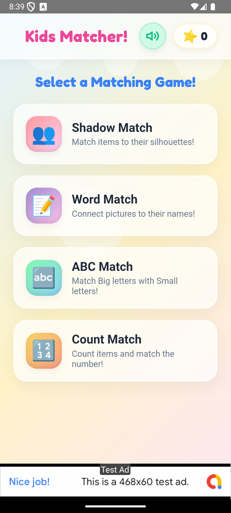
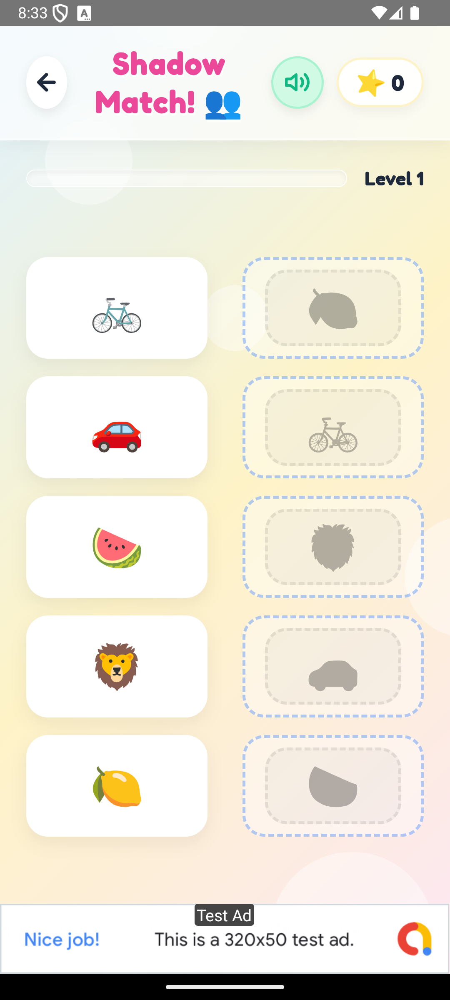
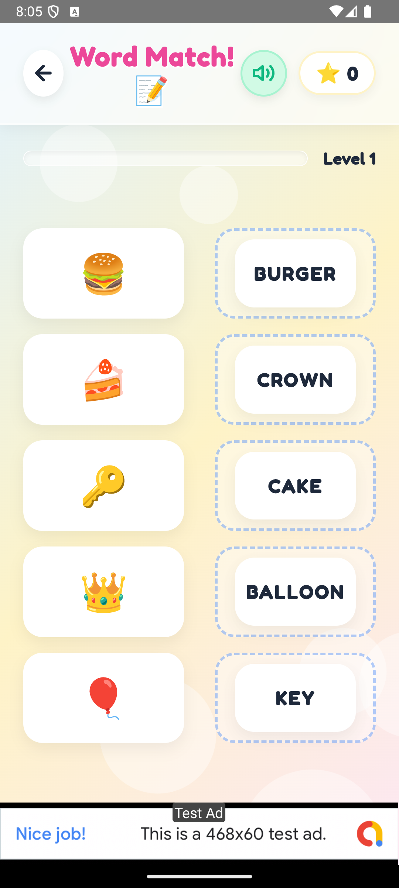
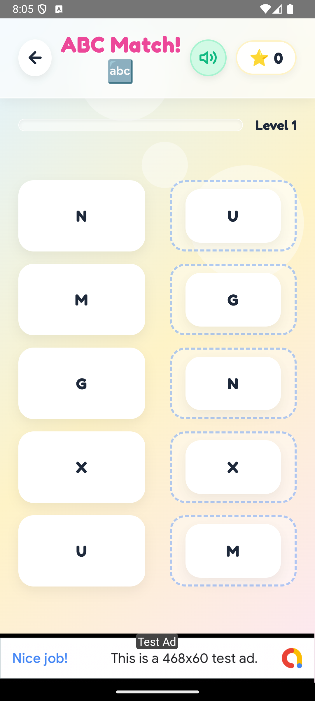
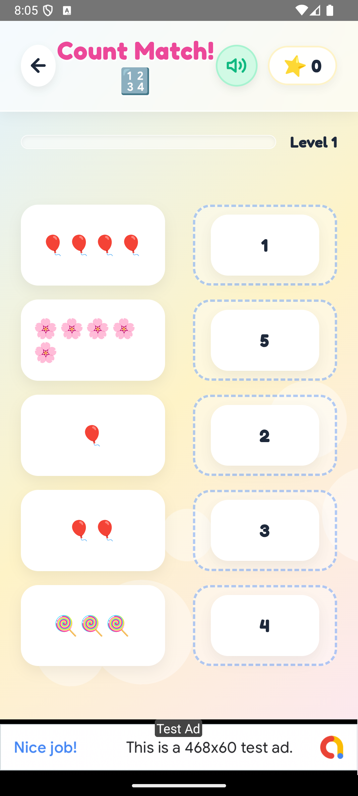

<div align="center">

# 🎮 Kids Word Match

**A premium, interactive educational matching game for young children.**

Match emojis to shadows · Match pictures to words · Match uppercase to lowercase · Count & match numbers

<br/>

[](https://developer.android.com)
[](https://capacitorjs.com)
[](https://vitejs.dev)
[](https://admob.google.com)
[](LICENSE)

</div>

---

## 📸 Screenshots

<div align="center">

| Home Screen | Shadow Match | Word Match |
|:-----------:|:------------:|:----------:|
|  |  |  |

| ABC Match | Count Match |
|:---------:|:-----------:|
|  |  |

</div>

---

## 🌟 Features at a Glance

| Feature | Description |
|---------|-------------|
| 🎮 **4 Game Modes** | Shadow Match, Word Match, ABC Match, Count Match |
| ♾️ **Infinite Levels** | Randomly-generated rounds from a rich dataset — no two games are the same |
| 🔊 **Synthesized Audio** | Zero audio files — all sounds built programmatically via the Web Audio API |
| 🗣️ **Text-to-Speech** | Correct matches trigger native TTS to pronounce the word aloud |
| 🎉 **Confetti Engine** | Full-screen Canvas particle system launched on round completion |
| ⭐ **Star Rewards** | 3 stars earned per round, persisted across sessions via `localStorage` |
| 📱 **Mobile-First** | Pointer-event drag-and-drop with full mobile & tablet support |
| 💰 **AdMob Ready** | Adaptive bottom banner ad via `@capacitor-community/admob` |
| 🧪 **Dev Cheat Mode** | Triple-tap the title bar to auto-solve any round for QA testing |

---

## 🎯 Game Modes in Detail

### 👥 Shadow Match
Drag colorful emoji cards onto matching dark silhouette drop zones.  
**Categories:** Animals 🦁 · Fruits 🍎 · Vehicles 🚀

### 📝 Word Match
Drag picture emoji cards and match them to their correct text label.  
**Categories:** Animals 🐶 · Yummy Foods 🍕 · Cool Toys & Things 🧸

### 🔤 ABC Match
Drag uppercase letter cards and drop them on the matching lowercase letter.  
**Full alphabet supported — A through Z** (26 letter pairs).

### 🔢 Count Match
Count the emojis shown on a card, then drop it on the matching digit.  
**Categories:** Stars ⭐ · Balloons 🎈 · Candies 🍭 · Flowers 🌸  
**Range:** 1–5 items per card.

---

## 🛠️ Tech Stack

| Layer | Technology | Notes |
|-------|-----------|-------|
| **UI/Structure** | HTML5, CSS3 | Semantic HTML, CSS custom properties, Grid & Flexbox |
| **Logic** | Vanilla JavaScript (ES Modules) | No frameworks — pure modern JS |
| **Build** | [Vite 5](https://vitejs.dev) | Dev server on `:3000`, sourcemaps in prod |
| **Native Runtime** | [Capacitor 6](https://capacitorjs.com) | Bridges web app to Android (& iOS) |
| **Ads** | [@capacitor-community/admob 6](https://github.com/capacitor-community/admob) | Adaptive bottom banner |
| **Typography** | [Fredoka](https://fonts.google.com/specimen/Fredoka) (Google Fonts) | Rounded, kid-friendly display font |
| **Audio** | Web Audio API | 100% synthetic — no audio files |
| **Speech** | Web Speech API (`SpeechSynthesis`) | Device-native TTS |

---

## 🏗️ Architecture Overview

```
Kids-Word-Match/
├── android/                        # Capacitor native Android project
│   └── app/src/main/
│       └── AndroidManifest.xml     # AdMob App ID meta-data goes here
├── assets/
│   ├── icon.png                    # App launcher icon
│   └── splash.png                  # Splash screen
├── play_store_assets/              # Google Play Store listing screenshots
│   ├── feature_graphic.png
│   ├── phone_screenshot_*.png      # Phone screenshots for all 4 modes
│   ├── tablet_7_screenshot_*.png   # 7" tablet screenshots
│   └── tablet_10_screenshot_*.png  # 10" tablet screenshots
├── public/                         # Static assets passed through by Vite
├── src/
│   ├── audio.js                    # Web Audio API synth engine + TTS
│   ├── confetti.js                 # Canvas 2D particle confetti engine
│   ├── data.js                     # Game data: all categories and word sets
│   ├── main.js                     # Game controller, drag & drop, AdMob init
│   └── style.css                   # Full design system, animations, bubble BG
├── index.html                      # App shell & DOM structure
├── capacitor.config.json           # Capacitor app ID + webDir config
├── vite.config.js                  # Vite dev server & build settings
└── package.json                    # Scripts & dependencies
```

### Core Module Breakdown

#### `src/main.js` — Game Controller
- **State management** via a single `state` object (current mode, round index, star count, matched count)
- **Drag & Drop** implemented with `PointerEvents` API (`pointerdown` / `pointermove` / `pointerup`) for cross-device touch and mouse support
- **Level system** uses `localStorage` to persist progress per game mode (`kid_matcher_level_<mode>`)
- **Round generation** shuffles a full flat pool of items, picks 5 with unique `matchValues`, then independently re-shuffles source and target columns so items never align visually
- **AdMob** initialised async via `initAdMob()` on DOM ready

#### `src/audio.js` — Synthesised Audio Engine
All sounds are built with `OscillatorNode` + `GainNode` — **no audio files loaded**.

| Sound | Implementation |
|-------|---------------|
| **Pop** | Sine wave · 450Hz → 150Hz sweep · 0.1s |
| **Correct** | Triangle wave arpeggio · C5 → E5 → G5 → C6 · 0.3s |
| **Incorrect** | Sawtooth wave + LFO vibrato · 140Hz → 110Hz · 0.22s |
| **Fanfare** | Dual-oscillator chorused brass · C4–C5 melody + final E5/G5/C6 chord |
| **TTS** | `SpeechSynthesisUtterance` · rate 0.85 · pitch 1.25 (kid-friendly) |

#### `src/confetti.js` — Particle Engine
- **120 particles** launched from bottom-left and bottom-right corners (party popper effect)
- Shapes: circle, rectangle, and 5-pointed star (drawn with Canvas path math)
- Physics: gravity (0.22), air resistance (vx × 0.99), opacity fade-out
- Auto-terminates after 3s by forcing rapid `fadeOutSpeed`; `requestAnimationFrame` loop self-cancels when all particles are dead

#### `src/data.js` — Game Dataset
```
shadow  → 3 categories × 10 items  = 30 items
word    → 3 categories × 8 items   = 24 items
alphabet→ 1 category  × 26 items   = 26 items
count   → 4 categories × 5 items   = 20 items
```
Each item has: `id`, `display` (emoji/letter), `matchValue`, and `text` (for TTS).

---

## 🚀 Getting Started

### Prerequisites

- [Node.js](https://nodejs.org/) **v18+**
- [npm](https://www.npmjs.com/) (bundled with Node)
- [Android Studio](https://developer.android.com/studio) — required only for Android builds
- Java JDK 17+ — required by Android Studio / Gradle

### Installation

```bash
# Clone the repository
git clone https://github.com/your-username/kids-word-match.git
cd kids-word-match/Kids-Word-Match

# Install all dependencies
npm install
```

### Local Development

```bash
npm run dev
# → Dev server starts at http://localhost:3000
```

The game runs fully in-browser. Drag & drop, audio, TTS, and confetti all work in Chrome/Edge.  
> **Note:** AdMob will not load in the browser — it requires the Capacitor native runtime.

### Production Build

```bash
npm run build
# → Optimised assets output to ./dist/ with sourcemaps
```

---

## 📱 Android Build Guide

### 1. Build Web Assets
```bash
npm run build
```

### 2. Sync with Capacitor
```bash
npx cap sync
# Copies ./dist/ into the Android project and updates native plugins
```

### 3. Open in Android Studio
```bash
npx cap open android
```

### 4. Run / Build from Android Studio
- **Debug run on device**: `Run > Run 'app'` (requires USB debugging or emulator)
- **Debug APK**: `Build > Build Bundle(s) / APK(s) > Build APK(s)`
- **Release AAB (Play Store)**: `Build > Generate Signed Bundle / APK > Android App Bundle`

### Full One-Line Workflow (after changes)
```bash
npm run build && npx cap sync && npx cap open android
```

---

## 💰 Google AdMob Configuration

AdMob keys are **never hardcoded** — they are loaded at build time via Vite environment variables.

### Step 1 — Create your `.env` file

Copy the provided example and fill in your real keys:

```bash
cp .env.example .env
```

Then open `.env` and set your values:

```env
VITE_ADMOB_APP_ID=ca-app-pub-XXXXXXXXXXXXXXXX~XXXXXXXXXX
VITE_ADMOB_BANNER_ID=ca-app-pub-XXXXXXXXXXXXXXXX/XXXXXXXXXX

# Use true during development, false before publishing to Play Store
VITE_ADMOB_IS_TESTING=true
```

> ⚠️ `.env` is listed in `.gitignore` — it will **never** be committed to version control.

### Step 2 — AndroidManifest.xml

Open `android/app/src/main/AndroidManifest.xml` and add your AdMob App ID inside `<application>`:

```xml
<meta-data
    android:name="com.google.android.gms.ads.APPLICATION_ID"
    android:value="ca-app-pub-XXXXXXXXXXXXXXXX~XXXXXXXXXX"/>
```

### Step 3 — Production Release Checklist

Before building the final Play Store release:

- [ ] Set `VITE_ADMOB_IS_TESTING=false` in `.env`
- [ ] Verify `AndroidManifest.xml` has the correct production App ID
- [ ] Run `npm run build && npx cap sync` to rebuild with the final env values

---

## 🧩 Extending the Game

### Adding New Words / Categories
Edit `src/data.js`. Each mode (`shadow`, `word`, `alphabet`, `count`) is an array of **category objects**:

```javascript
// Example: Adding a new "Space 🚀" category to Word Match
{
  theme: "Space 🚀",
  items: [
    { id: "moon",   display: "🌙", matchValue: "MOON",   text: "Moon" },
    { id: "sun",    display: "☀️", matchValue: "SUN",    text: "Sun" },
    { id: "planet", display: "🪐", matchValue: "PLANET", text: "Planet" },
    // ... add up to as many items as you want
  ]
}
```

The round system automatically samples 5 random items from the full combined pool — the more items you add, the more varied the gameplay becomes.

### Adding a New Game Mode
1. Add a new key to the `gameData` object in `src/data.js`
2. Add a new `<button class="category-card" data-mode="yourmode">` card in `index.html`
3. Add a title label in the `setupRound()` function inside `src/main.js`
4. Handle the new mode's display logic in the source/target rendering section of `setupRound()`

---

## 📋 Available Scripts

| Command | Description |
|---------|-------------|
| `npm run dev` | Start Vite dev server on `http://localhost:3000` |
| `npm run build` | Build optimised production bundle to `./dist/` |
| `npm run preview` | Preview the production build locally |
| `npx cap sync` | Sync web build + plugins with native Android project |
| `npx cap open android` | Open Android project in Android Studio |
| `npx cap run android` | Run app directly on a connected device/emulator |

---

## 🐛 Known Limitations

- **AdMob** requires the Capacitor native runtime — banners will not load in a standard browser.
- **Web Speech API** voice availability varies by device/OS. English voice is preferred but falls back to the device default if unavailable.
- **iOS**: Capacitor iOS platform is not currently configured in this repository. Android is the primary target.

---

## 🤝 Contributing

Contributions are welcome! To contribute:

1. Fork this repository
2. Create a feature branch: `git checkout -b feature/my-new-mode`
3. Make your changes and commit: `git commit -m 'feat: add new counting mode'`
4. Push to the branch: `git push origin feature/my-new-mode`
5. Open a Pull Request

Please keep pull requests focused — one feature or fix per PR.

---

## 📄 License

This project is licensed under the **MIT License** — see the [LICENSE](LICENSE) file for details.

---

<div align="center">

Made with ❤️ for little learners everywhere 👶

</div>
